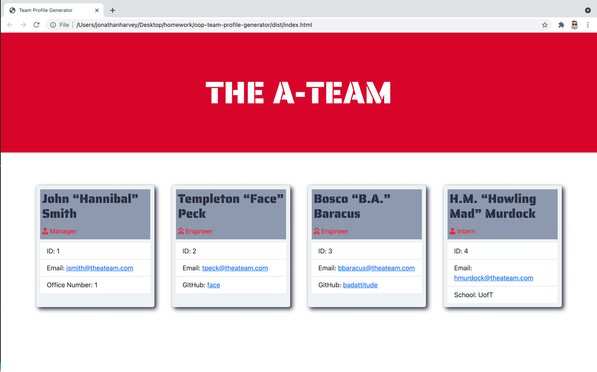

# OOP - Team Profile Generator

## Background

This was a homework assignment for the UofT Bootcamp.  Below is the user story and the acceptance criteria for reference.

## Table of Contents
[User Story](#user-story)\
[Acceptance Criteria](#acceptance-criteria)\
[Technologies](#technologies)\
[Process](#process)\
[Screen Shot](#screen-shot)\
[Walkthrough Video](#walkthrough-video)\
[Link](#link)


## User Story

```md
AS A manager
I WANT to generate a webpage that displays my team's basic info
SO THAT I have quick access to their emails and GitHub profiles
```

## Acceptance Criteria

```md
GIVEN a command-line application that accepts user input
WHEN I am prompted for my team members and their information
THEN an HTML file is generated that displays a nicely formatted team roster based on user input
WHEN I click on an email address in the HTML
THEN my default email program opens and populates the TO field of the email with the address
WHEN I click on the GitHub username
THEN that GitHub profile opens in a new tab
WHEN I start the application
THEN I am prompted to enter the team manager’s name, employee ID, email address, and office number
WHEN I enter the team manager’s name, employee ID, email address, and office number
THEN I am presented with a menu with the option to add an engineer or an intern or to finish building my team
WHEN I select the engineer option
THEN I am prompted to enter the engineer’s name, ID, email, and GitHub username, and I am taken back to the menu
WHEN I select the intern option
THEN I am prompted to enter the intern’s name, ID, email, and school, and I am taken back to the menu
WHEN I decide to finish building my team
THEN I exit the application, and the HTML is generated
```

## Technologies

* HTML
* CSS
* Bootstrap
* JavaScript
* Node.js
* Inquirer.js
* Jest

## Process

* For this project we were given no starter code, however we were told what how our application should be invoked, what the file structure should look like, and what properties and methods our classes should have.
* From there I created the classes, index.js, generateHTML.js, and then style.css
* Biggest challenges for this project were the tests and class constructors because they were new concepts.
* Credit to my TA's, tutor, and classmates.

## Screen Shot



## Walkthrough Video
https://drive.google.com/file/d/19vxYq2HyE9_aNU1Du0VDqjsRYqih_LZI/view